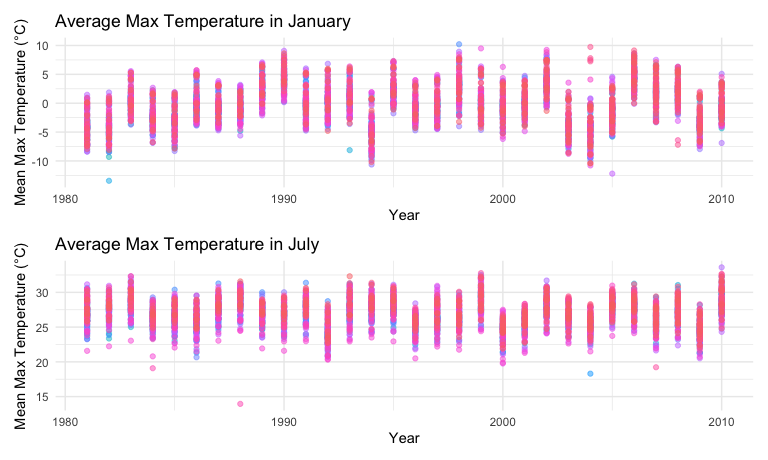

p8105_hw3_CY2772
================
Chenhui Yan
2024-10-13

# Load Libraries and Set Plot Settings

``` r
# Load necessary libraries
library(tidyverse)
```

    ## ── Attaching core tidyverse packages ──────────────────────── tidyverse 2.0.0 ──
    ## ✔ dplyr     1.1.4     ✔ readr     2.1.5
    ## ✔ forcats   1.0.0     ✔ stringr   1.5.1
    ## ✔ ggplot2   3.5.1     ✔ tibble    3.2.1
    ## ✔ lubridate 1.9.3     ✔ tidyr     1.3.1
    ## ✔ purrr     1.0.2     
    ## ── Conflicts ────────────────────────────────────────── tidyverse_conflicts() ──
    ## ✖ dplyr::filter() masks stats::filter()
    ## ✖ dplyr::lag()    masks stats::lag()
    ## ℹ Use the conflicted package (<http://conflicted.r-lib.org/>) to force all conflicts to become errors

``` r
library(ggplot2)
library(patchwork) # For combining plots
library(ggridges)
library(hexbin)     # For hexbin plots
library(lubridate)
library(p8105.datasets)

# Set global plot options
knitr::opts_chunk$set(
  fig.width = 8,
  fig.asp = .6,
  out.width = '90%'
)

options(
  ggplot2.continuous.color = 'viridis',
  ggplot2.continuous.fill = 'viridis'
)

scale_color_discrete = scale_color_viridis_d
scale_fill_discrete = scale_fill_viridis_d
```

# Problem 1

## Part a): Load and describe the Data:

``` r
data("ny_noaa")
# View the dimensions of the dataset
dim(ny_noaa)
```

    ## [1] 2595176       7

``` r
# View the structure of the dataset
str(ny_noaa)
```

    ## tibble [2,595,176 × 7] (S3: tbl_df/tbl/data.frame)
    ##  $ id  : chr [1:2595176] "US1NYAB0001" "US1NYAB0001" "US1NYAB0001" "US1NYAB0001" ...
    ##  $ date: Date[1:2595176], format: "2007-11-01" "2007-11-02" ...
    ##  $ prcp: int [1:2595176] NA NA NA NA NA NA NA NA NA NA ...
    ##  $ snow: int [1:2595176] NA NA NA NA NA NA NA NA NA NA ...
    ##  $ snwd: int [1:2595176] NA NA NA NA NA NA NA NA NA NA ...
    ##  $ tmax: chr [1:2595176] NA NA NA NA ...
    ##  $ tmin: chr [1:2595176] NA NA NA NA ...
    ##  - attr(*, "spec")=
    ##   .. cols(
    ##   ..   id = col_character(),
    ##   ..   date = col_date(format = ""),
    ##   ..   prcp = col_integer(),
    ##   ..   snow = col_integer(),
    ##   ..   snwd = col_integer(),
    ##   ..   tmax = col_character(),
    ##   ..   tmin = col_character()
    ##   .. )

``` r
# Summarize the dataset
summary(ny_noaa)
```

    ##       id                 date                 prcp               snow       
    ##  Length:2595176     Min.   :1981-01-01   Min.   :    0.00   Min.   :  -13   
    ##  Class :character   1st Qu.:1988-11-29   1st Qu.:    0.00   1st Qu.:    0   
    ##  Mode  :character   Median :1997-01-21   Median :    0.00   Median :    0   
    ##                     Mean   :1997-01-01   Mean   :   29.82   Mean   :    5   
    ##                     3rd Qu.:2005-09-01   3rd Qu.:   23.00   3rd Qu.:    0   
    ##                     Max.   :2010-12-31   Max.   :22860.00   Max.   :10160   
    ##                                          NA's   :145838     NA's   :381221  
    ##       snwd            tmax               tmin          
    ##  Min.   :   0.0   Length:2595176     Length:2595176    
    ##  1st Qu.:   0.0   Class :character   Class :character  
    ##  Median :   0.0   Mode  :character   Mode  :character  
    ##  Mean   :  37.3                                        
    ##  3rd Qu.:   0.0                                        
    ##  Max.   :9195.0                                        
    ##  NA's   :591786

### A short description of the dataset:

- The ny_noaa dataset contains 2,595,176 observations and 7 variables.
- Variables:
  - id: Weather station identifier.
  - date: Date of the observation.
  - prcp: Precipitation (tenths of mm).
  - snow: Snowfall (mm).
  - snwd: Snow depth (mm).
  - tmax: Maximum temperature (tenths of degrees C).
  - tmin: Minimum temperature (tenths of degrees C).

### Missing Data:

``` r
# Calculate missing data percentages
ny_noaa %>%
  summarise(
    prcp_missing = mean(is.na(prcp)) * 100,
    snow_missing = mean(is.na(snow)) * 100,
    snwd_missing = mean(is.na(snwd)) * 100,
    tmax_missing = mean(is.na(tmax)) * 100,
    tmin_missing = mean(is.na(tmin)) * 100
  )
```

    ## # A tibble: 1 × 5
    ##   prcp_missing snow_missing snwd_missing tmax_missing tmin_missing
    ##          <dbl>        <dbl>        <dbl>        <dbl>        <dbl>
    ## 1         5.62         14.7         22.8         43.7         43.7

- Observations:
  - Approximately 5.62% of prcp values are missing.
  - Approximately 14.68% of snow values are missing.
  - Approximately 22.80% of snwd values are missing.
  - A significant portion of tmax (43.69%) and tmin (46.23%) values are
    missing.

## Part b): Data cleaning

### Create Year, Month, and Day Variables

``` r
# Create separate variables for year, month, and day
ny_noaa = ny_noaa %>%
  mutate(
    year = year(date),
    month = month(date),
    day = day(date)
  )
```

### Convert Units to Reasonable Measures

- Temperature: Convert from tenths of degrees Celsius to degrees
  Celsius.
- Precipitation: Convert from tenths of mm to mm.

``` r
# Convert `prcp`, `tmax`, and `tmin` to numeric before changing units
ny_noaa = ny_noaa %>%
  mutate(
    prcp = as.numeric(prcp),
    tmax = as.numeric(tmax),
    tmin = as.numeric(tmin)
  )
# Adjust units for temperature and precipitation
ny_noaa = ny_noaa %>%
  mutate(
    prcp = prcp / 10,  # Precipitation in mm
    tmax = tmax / 10,  # Max temp in °C
    tmin = tmin / 10   # Min temp in °C
  )
```

### Identify Most Common Snowfall Values

``` r
# Count the occurrences of each snowfall value
snow_counts = ny_noaa %>%
  count(snow) %>%
  arrange(desc(n))

# View the most common snowfall values
head(snow_counts)
```

    ## # A tibble: 6 × 2
    ##    snow       n
    ##   <int>   <int>
    ## 1     0 2008508
    ## 2    NA  381221
    ## 3    25   31022
    ## 4    13   23095
    ## 5    51   18274
    ## 6    76   10173

- The most commonly observed value for snowfall is 0 mm, with 2,008,508
  occurrences.
- This is expected as snowfall doesn’t occur every day, especially
  outside the winter months.

## Part c) Visualization:

### Average Max Temperature in January and July Across Years

``` r
##Prepare Data
# Filter data for January and July
jan_jul_temps = ny_noaa %>%
  filter(month %in% c(1, 7)) %>%
  group_by(id, year, month) %>%
  summarise(
    mean_tmax = mean(tmax, na.rm = TRUE),
    .groups = 'drop'
  ) %>%
  mutate(month = if_else(month == 1, "January", "July"))
##Create Plots
# Plot for January
p_jan = ggplot(jan_jul_temps %>% filter(month == "January"), 
                aes(x = year, y = mean_tmax, group = id, color = id)) +
  geom_point(alpha = 0.5) +
  labs(
    title = "Average Max Temperature in January",
    x = "Year",
    y = "Mean Max Temperature (°C)"
  ) +
  theme_minimal() +
  theme(legend.position = "none")

# Plot for July
p_jul <- ggplot(jan_jul_temps %>% filter(month == "July"), 
                aes(x = year, y = mean_tmax, group = id, color = id)) +
  geom_point(alpha = 0.5) +
  labs(
    title = "Average Max Temperature in July",
    x = "Year",
    y = "Mean Max Temperature (°C)"
  ) +
  theme_minimal() +
  theme(legend.position = "none")

# Combine plots using patchwork
(p_jan / p_jul) + plot_layout(heights = c(1, 1))
```

    ## Warning: Removed 2923 rows containing missing values or values outside the scale range
    ## (`geom_point()`).

    ## Warning: Removed 3047 rows containing missing values or values outside the scale range
    ## (`geom_point()`).



- Seasonal Patterns:

  - The January plot shows mean maximum temperatures below freezing for
    many stations. This is expected, as January is a winter month in New
    York.
  - The July plot shows mean maximum temperatures generally around 25°C
    to 30°C, which aligns with typical summer weather.

- Yearly Variation:

  - In both January and July, there is a regular seasonal cycle where
    temperatures seem consistent year-over-year, suggesting stability in
    average seasonal temperatures over time.
  - However, in some years, the spread of the data seems more
    significant, indicating variations between different weather
    stations or some abnormal weather patterns.

- Outliers:

  - January: There are a few points that appear significantly lower than
    others, especially in the 1980s, indicating some extremely cold
    values. These could be legitimate observations or data errors.
  - July: There are some outliers around 15°C, which seem lower than the
    rest of the data points in the same period. These could be caused by
    errors in data collection or unusual weather events.
